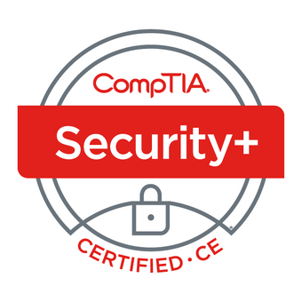

<h1 dir='rtl' align='right'>تجربتي مع اختبار +CompTIA Security</h1>

</img>

<h2 dir='rtl' align='right'>مقدمة</h2>

في هذا المقال سأقوم بمشاركتكم تجربتي مع شهادة CompTIA +Security (SY0-501) وكيف قمت بالتحضير للاختبار الخاص بها. أتمنى أن تكون أي من المصادر أو النصائح التي سأقوم بذكرها هنا مفيدة لأي شخص مقبل على التحضير للاختبار الخاص بالشهادة.

<h2 dir='rtl' align='right'>خبرتي</h2>

قبل البدء بالتفاصيل، أود أن أوضح لكم خبرتي المتواضعة في مجال الأمن السيبراني:

<ul dir='rtl'>
  <li>حاصل على شهادة الماجستير في الأمن السيبراني، وحاليا أكمل دراسة الدكتوراه في نفس المجال.</li>
  <li>حصلت مؤخرا (قبل شهر ونصف تقريبا من البدء بالتحضير لشهادة +Security) على شهادة CISSP من ISC2.</li>
</ul>

والآن لنبدأ بتفاصيل الشهادة.

<h2 dir='rtl' align='right'>ماهي شهادة +CompTIA Security ؟</h2>

تعتبر شهادة +CompTIA Security من الشهادات الجيدة لأي شخص يريد البدء بالتخصص في أي مجال متعلق بالأمن السيبراني من حماية شبكات واختراق أخلاق، وغيرها من التخصصات ذات الصلة، حيث أن محتوى التحضير للشهادة يغطي أغلب المصطلحات والمسميات المتعارف عليها، والمفاهيم الأساسية، في مجال الأمن السيبراني.
كما تعتبر هذه الشهادة شهادة فنية، وليست إدارية. ولكنها لا تغطي جميع النواحي التقنية بشكل تفصيلي ودقيق، بل أنها تغطي وبشكل سطحي عدد من المفاهيم والمصلحات بدون تعمق. فإذا كنت تريد بداية جيدة في مجال الأمن السيبراني وشهاداته، فهذه الشهادة جيدة لك. أما إذا كنت ترغب في فهم المفاهيم التقنية بشكل معمق وتفصيلي، فعليك البحث عن شهادة أكثر تقنية أكثر تقدما.

<h2 dir='rtl' align='right'>تفاصيل الشهادة:</h2>

هذه التفاصيل ستقوم بالإجابة على استفسارات العديد ممن يقرء هذا المقال حاليا:

<ul dir='rtl'>
  <li><b>عدد الأسئلة: </b>70 سؤال تقريبا (يختلف عدد الأسئلة حسب نسخة الاختبار التي ستقدم لك خلال فترة اختبارك)</li>
  <li><b>مدة الاختبار: </b>90 دقيقة</li>
  <li><b>درجة النجاح: </b>750  نقطة من أصل 900</li>
  <li><b>رسوم الاختبار: </b>349 دولار أمريكي</li>
</ul>

<h2 dir='rtl' align='right'>المراجع المستخدمة في التحضير للاختبار:</h2>

هذه المراجع التي استخدمتها خلال فترة التحضير:

<ul dir="rtl">
<li><a href="https://www.comptia.org/certifications/security">مستند المحاور الرئيسية والفرعية (Exam Objectives)</a>: يمكن تحميل هذا المستند من الصفحة الرئيسية للشهادة (تأكد أنك تقوم باستخدام أحدث نسخة من المستند عند البدء بالتحضير للاختبار).</li>
<li><a href="https://www.youtube.com/playlist?list=PLG49S3nxzAnnVhoAaL4B6aMFDQ8_gdxAy">قناة Professor Messer</a>: قناة في اليوتيوب. من وجهة نظري بأن القناة جبارة بمعنى الكلمة للتجهيز لاختبارات +A و +Network و +Security. فيما يخص جزئية +Security، يمكنك الذهاب إلى هذا الرابط والذي يحتوي على مجموعة الفيديوهات الخاصة بالشهادة (إجمالي 13 ساعة)، مرتبة حسب ترتيب المحاور الفرعية والرئيسة بمستند (Exam Objectives) الرسمي.</li>
<li><a href="https://www.udemy.com/course/comptia-security-practice-exams/">كورس Json Dion في موقع Udemy</a>: هو ليس كورس بمعنى الكلمة، بل عدد (6) اختبارات تجريبية تحاكي بشكل كبير الاختبار الواقعي. تكلفة الكورس (11.99) باوند (جنية إسترليني).</li>
<li><a href="https://www.examcompass.com/comptia/security-plus-certification/free-security-plus-practice-tests">اختبارات قصيرة مجانية</a>: مجموعة أسئلة واختبارات قصيرة مجانية. لم أقم بالاعتماد عليها بشكل كبير خلال فترة تحضري، حيث أكتفيت بالاختبارات التي قمت بشرائها من Udemy.</li>
</ul>

هذه هي المراجع التي مررت عليها خلال فترة الاعداد، حيث لم اعتمد هذه المرة على أي من الكتب في عملية التحضير، على عكس عادتي.

سأقوم بذكر هذه المراجع وكيف استخدمتها في التحضير للاختبار.

<h2 dir='rtl' align='right'>منهجية التحضير للاختبار:</h2>

بما أني قمت باجتياز اختبار CISSP مؤخرا (والذي اعتبره أصعب من اختبار +Security بمراحل عديدة)، فقد تمكنت من الاعداد لاختبار +Security في أربعة أيام فقط. نعم أربعة أيام فقط 😊. إليكم ما قمت به خلال الأربعة أيام:

<h3 dir='rtl' align='right'>اليوم الأول (04/08/2020):</h3>
<ul dir='rtl'>
  <li>قمت بتحميل وطباعة مستند المحاور الرئيسية (Exam Objectives). يمكنك الحصول على نسخة المستند من الموقع الرسمي للاختبار.</li>
  <li>بعد طباعة المستند، قمت بمراجعة عدد (3) محاور رئيسية (من أصل إجمالي 6 محاور رئيسية) بمحاورها الفرعية واستخدام قلم highlighter لتعليم كل ما لدي خبرة به. للمحاور التي لم أملك فيها المعرفة الكافية، أقوم بالرجوع لقناة Professor Messer ومشاهدة الفيديوهات المتعلقة بهذه المحاور.</li>
</ul>

<h3 dir='rtl' align='right'>اليوم الثاني (05/08/2020):</h3>
<ul dir='rtl'>
  <li>قمت باستكمال مراجعة عدد (3) محاور رئيسة الأخرى في المستند، والرجوع إلى فيديوهات Professor Messer حسب الحاجة، كما تم في اليوم الأول.</li>
</ul>

<h3 dir='rtl' align='right'>اليوم الثالث (06/08/2020):</h3>
<ul dir='rtl'>
  <li>بما أني قمت في اليوميين الأول والثاني بتغطية جميع محاور الاختبار، فقد قمت بالتسجيل للاختبار حيث أن أقرب موعد كان بتاريخ (08/08/2020)، مما يترك لي يومين للقيام بالاختبارات التجريبية.</li>
  <li>أجريت عدد (3) اختبارات تجريبية التي قمت بشرائها من Udemy، وكانت هذه نتائجي:</li>
  <ul dir='rtl'>
    <li>الاختبار الأول: 85%</li>
    <li>الاختبار الثاني: 91%</li>
    <li>الاختبار الثالث: 91%</li>
  </ul>
</ul>

<h3 dir='rtl' align='right'>اليوم الرابع (07/08/2020):</h3>
<ul dir='rtl'>
  <li>أجريت الاختبارات التجريبية المتبقية، وكانت النتائج كالتالي:</li>
  <ul dir='rtl'>
    <li>الاختبار الرابع: 77%</li>
    <li>الاختبار الخامس: 94%</li>
    <li>الاختبار السادس: 87%</li>
  </ul>
</ul>

<h3 dir='rtl' align='right'>يوم الامتحان (09/08/2020) – يكرم المرء أو يهان:</h3>
<ul dir='rtl'>
  <li>اختباري كان في تمام الساعة 7:30 صباحا (أفضل الصباح الباكر لتقديم أي نوع من الاختبارات).</li>
  <li>بفضل من الله، قمت باجتياز الاختبار وكانت الدرجة المحرزة (822) من أصل (950).</li>
  <li>عدد الأسئلة في اختباري كانت (82) سؤال. وواجهت أسئلة في بداية الاختبار (عددها من 4-5 تقريبا) تسمى ب (performance-based questions) وكانت عبارة عن (drag-and-drop) وواحد عبارة عن تعريف لبعض الاعدادات المتعلقة بإعدادات حماية الشبكة اللاسلكية.</li>
</ul>

<h2 dir='rtl' align='right'>نصائح متفرقة</h2>

هذه بعض النصائح المتفرقة التي قد تكون مفيدة للمقبلين على تقديم الاختبار:

<ul dir='rtl'>
  <li>استخدم أقلام highlighter مع مستند محاور الاختبار للتعليم على المحاور التي أتقنتها. سيساعدك ذلك على الاطلاع على نسبة انجازك بشكل سريع.</li>
  <li>عند اكمالك لنسبة 50% من المحاور الرئيسية للاختبار، قم بحجز موعد الاختبار لضمان التزامك بتقديم الاختبار والحصول على الشهادة.</li>
  <li>استخدم الاختبارات التجريبية التي قمت بذكرها أعلاه. إن حصلت على درجة أعلى من 80% في معظمها، فستنجح في الاختبار الفعلي بإذن الله.</li>
  <li>توكل على الله وابدأ التجهيز للاختبار.</li>
</ul>

<h2 dir='rtl' align='right'>التواصل</h2>

يمكنك التواصل معي على تويتر: <a href="https://www.twitter.com/AKhalil_90">@AKhalil_90</a>

